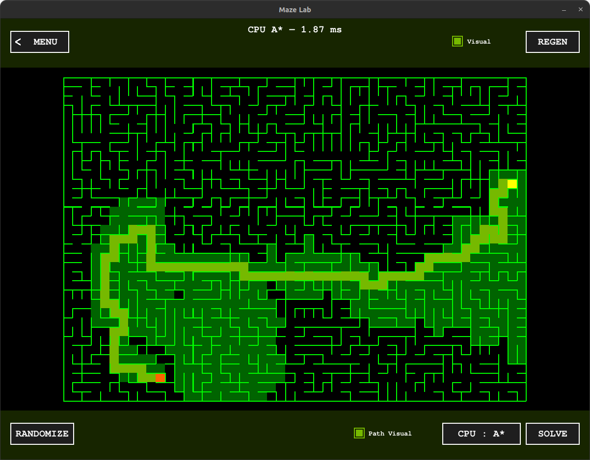
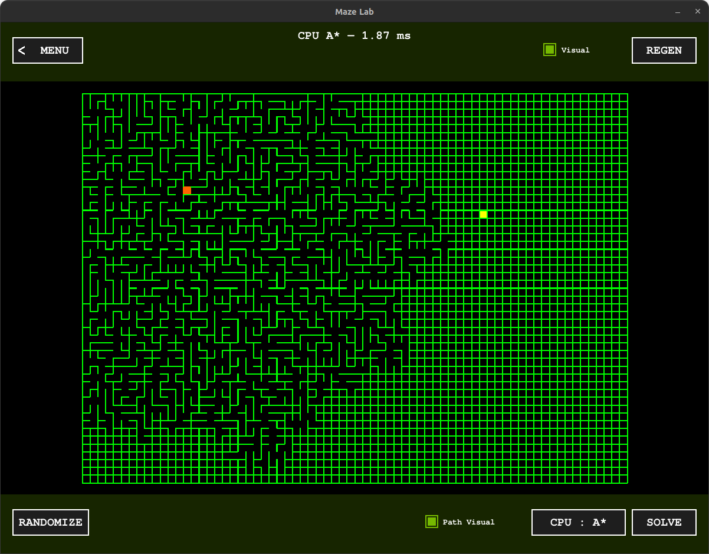
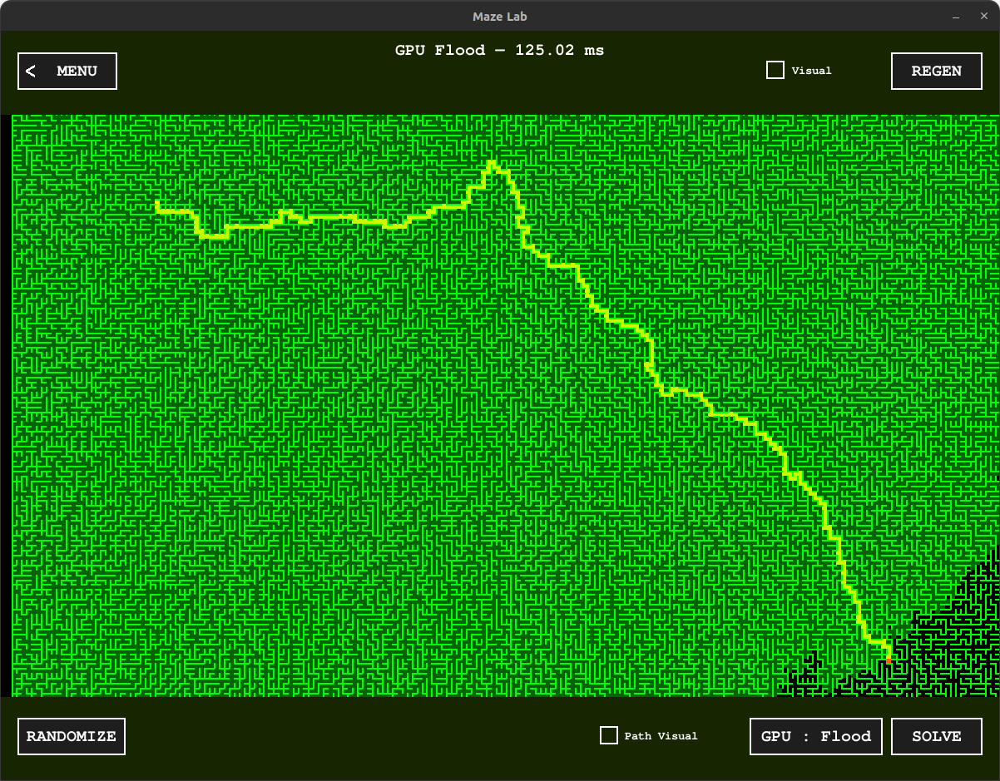

# 🟩 Maze Lab — Interactive Maze Generator & Solver

[](https://www.python.org/)
[](https://www.pygame.org/news)
[](https://numba.pydata.org/)

---

## 🚀 Project Overview

**Maze Lab** is an interactive Python application for generating and solving mazes. It combines **procedural maze generation** with **pathfinding algorithms**, including CPU-based A* and GPU-accelerated flood-fill, to visualize and explore algorithms in real-time.



---

## 🌟 Key Features

- **Dynamic Maze Generation:** Procedural mazes using **Prim’s algorithm**, supporting custom grid sizes.
- **Dual Engine Pathfinding:**
  - **CPU A\***: Optimized heuristic search for precision pathfinding.
  - **GPU Flood-Fill**: Parallel wavefront expansion using **Numba + CUDA** (if GPU available).
- **Real-Time Visualization:** Toggle maze generation, pathfinding visualization, and see the algorithms in action.
- **Interactive GUI:** Zoom, pan, and adaptive rendering of the maze.
- **Performance Metrics:** Real-time **timing display** to compare algorithm efficiency.


<div style="display: flex; justify-content: center;">
  
  
</div>


---

## 🎮 Controls

* **Mouse Wheel:** Zoom In / Out.
* **Left Click + Drag:** Pan across the maze.
* **REGEN:** Create a new maze architecture.
* **SOLVE:** Execute the selected pathfinding engine.
* **GPU/CPU Toggle:** Switch between hardware acceleration modes.
* **RANDOMIZE:** Relocate the Start and Goal points instantly.

---

## 🛠️ Requirements

- **Python 3.x**  
- **Pygame**  
- **Numba** (for GPU acceleration, optional)  
- **CUDA Toolkit** (if using GPU acceleration)

Install dependencies:

```bash
pip install pygame numba
